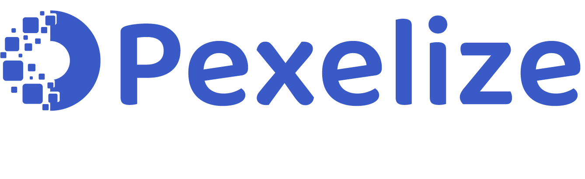

<p align="center">
  <a href="https://pexelize.com">
    
  </a>
</p>

<p align="center">
  <a href="https://www.npmjs.com/package/@pexelize/angular-email-editor"></a>
  <a href="https://github.com/Pexelize/pexelize-angular-email-editor/blob/main/LICENSE"></a>
</p>

# @pexelize/angular-email-editor

Angular component for building **email templates** with drag-and-drop. Embed a full-featured **email editor** into your Angular app — create responsive HTML emails, newsletters, transactional email templates, and email marketing campaigns visually without writing code.

[Pexelize](https://pexelize.com) is a modern **email builder** and **email template editor** that lets your users design professional emails with a visual drag-and-drop interface.

[Website](https://pexelize.com) | [Documentation](https://docs.pexelize.com) | [Dashboard](https://developers.pexelize.com)

<p align="center">
  
</p>

## Features

- Drag-and-drop **email template builder** with 20+ content blocks
- Responsive **HTML email** output compatible with all major email clients
- **Newsletter editor** with merge tags, dynamic content, and display conditions
- Visual **email designer** — no HTML/CSS knowledge required for end users
- Export to HTML, JSON, image, PDF, or ZIP
- Built-in image editor, AI content generation, and collaboration tools
- Full TypeScript support
- Works with NgModule and standalone components (Angular 14+)

## Installation

The SDK is loaded from CDN automatically — you only need to install the Angular package.

```bash
npm install @pexelize/angular-email-editor
```

```bash
yarn add @pexelize/angular-email-editor
```

```bash
pnpm add @pexelize/angular-email-editor
```

## Editor Key

An `editorKey` is required to use the editor. You can get one by creating a project on the [Pexelize Developer Dashboard](https://developers.pexelize.com).

## Usage

### NgModule

```typescript
import { NgModule } from "@angular/core";
import { BrowserModule } from "@angular/platform-browser";
import { PexelizeEditorModule } from "@pexelize/angular-email-editor";
import { AppComponent } from "./app.component";

@NgModule({
  declarations: [AppComponent],
  imports: [BrowserModule, PexelizeEditorModule],
  bootstrap: [AppComponent],
})
export class AppModule {}
```

```typescript
import { Component, ViewChild } from "@angular/core";
import {
  PexelizeEditorComponent,
  DesignJson,
  PexelizeSDK,
} from "@pexelize/angular-email-editor";

@Component({
  selector: "app-email-editor",
  template: `
    <div class="toolbar">
      <button (click)="handleSave()">Save</button>
      <button (click)="handleExport()">Export HTML</button>
    </div>
    <pexelize-editor
      #editor
      [editorKey]="'YOUR_EDITOR_KEY'"
      [editorMode]="'email'"
      [height]="800"
      (ready)="onReady($event)"
      (change)="onChange($event)"
    ></pexelize-editor>
  `,
})
export class EmailEditorComponent {
  @ViewChild("editor") editor!: PexelizeEditorComponent;

  onReady(sdk: PexelizeSDK): void {
    console.log("Editor ready!", sdk);
  }

  onChange(data: { design: DesignJson; type: string }): void {
    console.log("Design changed:", data.design);
  }

  async handleSave(): Promise<void> {
    const design = await this.editor.getDesign();
    console.log("Design:", design);
  }

  async handleExport(): Promise<void> {
    const html = await this.editor.exportHtml();
    console.log("HTML:", html);
  }
}
```

### Standalone Component (Angular 15+)

```typescript
import { Component, ViewChild } from "@angular/core";
import { PexelizeEditorComponent } from "@pexelize/angular-email-editor";

@Component({
  selector: "app-editor",
  standalone: true,
  imports: [PexelizeEditorComponent],
  template: `
    <pexelize-editor
      #editor
      [editorKey]="'YOUR_EDITOR_KEY'"
      [editorMode]="'email'"
      (ready)="onReady($event)"
    ></pexelize-editor>
  `,
})
export class EditorComponent {
  @ViewChild("editor") editor!: PexelizeEditorComponent;

  onReady(): void {
    console.log("Editor ready!");
  }
}
```

## Inputs

| Input               | Type                                     | Default      | Description                           |
| ------------------- | ---------------------------------------- | ------------ | ------------------------------------- |
| `editorKey`         | `string`                                 | **required** | Editor key for authentication         |
| `design`            | `DesignJson \| ModuleData \| null`       | `undefined`  | Initial design to load                |
| `editorMode`        | `EditorMode`                             | `"email"`    | `"email"`, `"web"`, or `"popup"`      |
| `popup`             | `PopupConfig`                            | `undefined`  | Popup configuration                   |
| `contentType`       | `EditorContentTypeValue`                 | `undefined`  | Set to `"module"` for single-row mode |
| `ai`                | `AIConfig`                               | `undefined`  | AI features configuration             |
| `locale`            | `string`                                 | `undefined`  | UI locale                             |
| `translations`      | `Record<string, Record<string, string>>` | `undefined`  | Translation overrides                 |
| `textDirection`     | `TextDirection`                          | `undefined`  | `"ltr"` or `"rtl"`                    |
| `language`          | `Language`                               | `undefined`  | Template language                     |
| `appearance`        | `AppearanceConfig`                       | `undefined`  | Visual customization                  |
| `tools`             | `ToolsConfig`                            | `undefined`  | Tool enable/disable                   |
| `customTools`       | `PexelizeToolConfig[]`                   | `undefined`  | Custom tool definitions               |
| `features`          | `FeaturesConfig`                         | `undefined`  | Feature toggles                       |
| `fonts`             | `FontsConfig`                            | `undefined`  | Fonts configuration                   |
| `bodyValues`        | `Record<string, unknown>`                | `undefined`  | Body-level values                     |
| `header`            | `unknown`                                | `undefined`  | Locked header row                     |
| `footer`            | `unknown`                                | `undefined`  | Locked footer row                     |
| `mergeTags`         | `MergeTagsConfig`                        | `undefined`  | Merge tags configuration              |
| `specialLinks`      | `SpecialLinksConfig`                     | `undefined`  | Special links configuration           |
| `modules`           | `Module[]`                               | `undefined`  | Custom modules                        |
| `displayConditions` | `DisplayConditionsConfig`                | `undefined`  | Display conditions                    |
| `editor`            | `EditorBehaviorConfig`                   | `undefined`  | Editor behavior settings              |
| `customCSS`         | `string[]`                               | `undefined`  | Custom CSS URLs                       |
| `customJS`          | `string[]`                               | `undefined`  | Custom JS URLs                        |
| `height`            | `string \| number`                       | `"600px"`    | Editor height                         |
| `minHeight`         | `string \| number`                       | `"600px"`    | Minimum height                        |
| `options`           | `Partial<EditorOptions>`                 | `undefined`  | Additional editor options             |
| `callbacks`         | `Omit<PexelizeCallbacks, ...>`           | `undefined`  | SDK callbacks                         |

| `collaboration`     | `boolean \| CollaborationFeaturesConfig` | `undefined`  | Collaboration settings                |
| `user`              | `UserInfo`                               | `undefined`  | Current user info                     |
| `designMode`        | `"edit" \| "live"`                       | `undefined`  | Template permissions mode             |

## Outputs

| Output          | Payload Type                           | Description                      |
| --------------- | -------------------------------------- | -------------------------------- |
| `ready`         | `PexelizeSDK`                          | Emitted when the editor is ready |
| `load`          | `unknown`                              | Emitted when a design is loaded  |
| `change`        | `{ design: DesignJson; type: string }` | Emitted on every design change   |
| `error`         | `Error`                                | Emitted when an error occurs     |
| `commentAction` | `CommentAction`                        | Emitted on comment events        |

## Methods

Access methods via `@ViewChild`:

```typescript
@ViewChild('editor') editor!: PexelizeEditorComponent;
```

### Design

| Method                         | Returns   | Description            |
| ------------------------------ | --------- | ---------------------- |
| `loadDesign(design, options?)` | `void`    | Load a design          |
| `loadBlank(options?)`          | `void`    | Load a blank design    |
| `getDesign()`                  | `Promise` | Get the current design |

### Export

| Method                  | Returns                    | Description          |
| ----------------------- | -------------------------- | -------------------- |
| `exportHtml(options?)`  | `Promise<string>`          | Export as HTML       |
| `exportJson()`          | `Promise<DesignJson>`      | Export as JSON       |
| `exportPlainText()`     | `Promise<string>`          | Export as plain text |
| `exportImage(options?)` | `Promise<ExportImageData>` | Export as image      |
| `exportPdf(options?)`   | `Promise<ExportPdfData>`   | Export as PDF        |
| `exportZip(options?)`   | `Promise<ExportZipData>`   | Export as ZIP        |

### Configuration

| Method                             | Returns | Description               |
| ---------------------------------- | ------- | ------------------------- |
| `setMergeTags(config)`             | `void`  | Update merge tags         |
| `setSpecialLinks(config)`          | `void`  | Update special links      |
| `setModules(modules)`              | `void`  | Update custom modules     |
| `setFonts(config)`                 | `void`  | Update fonts              |
| `setBodyValues(values)`            | `void`  | Update body values        |
| `setToolsConfig(config)`           | `void`  | Update tools config       |
| `setAppearance(config)`            | `void`  | Update appearance         |
| `setEditorMode(mode)`              | `void`  | Change editor mode        |
| `setEditorConfig(config)`          | `void`  | Update editor config      |
| `setLocale(locale, translations?)` | `void`  | Change locale             |
| `setTextDirection(direction)`      | `void`  | Set text direction        |
| `setLanguage(language)`            | `void`  | Set template language     |
| `setDisplayConditions(config)`     | `void`  | Update display conditions |
| `setOptions(options)`              | `void`  | Update editor options     |
| `setBrandingColors(config)`        | `void`  | Update branding colors    |

### Editor Actions

| Method                 | Returns                | Description                |
| ---------------------- | ---------------------- | -------------------------- |
| `save()`               | `void`                 | Trigger a save event       |
| `undo()`               | `void`                 | Undo last action           |
| `redo()`               | `void`                 | Redo last action           |
| `canUndo()`            | `Promise<boolean>`     | Check if undo is available |
| `canRedo()`            | `Promise<boolean>`     | Check if redo is available |
| `showPreview(device?)` | `void`                 | Show design preview        |
| `hidePreview()`        | `void`                 | Hide preview               |
| `audit(options?)`      | `Promise<AuditResult>` | Run design audit           |

### Tools & Widgets

| Method                 | Returns   | Description            |
| ---------------------- | --------- | ---------------------- |
| `registerTool(config)` | `Promise` | Register a custom tool |
| `unregisterTool(id)`   | `Promise` | Unregister a tool      |
| `getTools()`           | `Promise` | Get registered tools   |
| `createWidget(config)` | `Promise` | Create a widget        |
| `removeWidget(name)`   | `Promise` | Remove a widget        |

### Events

| Method                                 | Returns      | Description                                         |
| -------------------------------------- | ------------ | --------------------------------------------------- |
| `addEventListener(event, callback)`    | `() => void` | Subscribe to an event; returns unsubscribe function |
| `removeEventListener(event, callback)` | `void`       | Remove an event listener                            |

## TypeScript

All types are exported from `@pexelize/angular-email-editor`:

```typescript
import type {
  DesignJson,
  EditorMode,
  PexelizeSDK,
  MergeTagsConfig,
  AppearanceConfig,
  FeaturesConfig,
  ToolsConfig,
  FontsConfig,
} from "@pexelize/angular-email-editor";
```

## Contributing

See [CONTRIBUTING.md](./CONTRIBUTING.md) for guidelines on how to contribute to this project.

## License

[MIT](./LICENSE)
